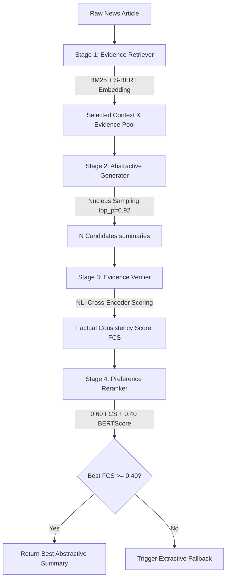

# Two-Stage Summarisation Pipeline — Current Design & Improvement Plan

This document details the current architecture, processing flows, and evaluation mechanisms of the M.Tech dissertation codebase, followed by a concrete execution plan for caching, optimization, failure recovery, and transient retries.

---

## 1. Current Design & Architecture Flows

The system implements an **Extraction-Guided Abstractive Generation** summarisation pipeline structured into four sequential stages. It is designed to maximize factual consistency while maintaining linguistic fluency.



### Stage-by-Stage Mechanisms

#### Stage 1: Evidence Retriever (`pipeline/retrieval.py`)
- **Flow**: Splits the raw article into sentences. Computes scores using two parallel components:
  1. **Lexical (BM25)**: Evaluates term-overlap matches.
  2. **Semantic (Sentence-BERT)**: Generates embeddings using `sentence-transformers/all-MiniLM-L6-v2` and computes cosine similarity against the article query.
- **Combination**: Combines lexical and semantic scores (`0.5 * BM25 + 0.5 * Semantic`) to build an **Evidence Pool**.
- **Context Selection**: Extracts the top $K$ sentences (default `RETRIEVAL_K = 8`) to assemble the `selected_context` (constrained by `BART_MAX_INPUT`).

#### Stage 2: Abstractive Generator (`pipeline/generator.py`)
- **Flow**: Inputs the retrieved `selected_context` into the fine-tuned BART-large generator (`BART_TRAIN_MODEL = "facebook/bart-large"`).
- **Sampling**: Generates `NUM_CANDIDATES = 5` summaries using Nucleus Sampling (`top_p = 0.92`, `temperature = 1.0`). Diverse candidates allow Stage 3 & 4 to select the most factually accurate summary.

#### Stage 3: Evidence Verifier (`pipeline/verifier.py`)
- **Flow**: Evaluates each candidate summary against the full **Evidence Pool** sentence-by-sentence.
- **NLI Scoring**: Uses a cross-encoder model `cross-encoder/nli-deberta-v3-base` to predict the entailment probability between each summary sentence and its best-matching evidence sentence.
- **Metric**: The mean entailment probability forms the **Factual Consistency Score (FCS)** ($0 \le FCS \le 1$).

#### Stage 4: Preference Reranker (`pipeline/reranker.py`)
- **Rerank Metric**: Combines the verifier score and semantic fluency:
  $$\text{Final Score} = 0.60 \times FCS + 0.40 \times \text{BERTScore-F1}$$
- **Fallback Badge**: If the top candidate's FCS falls below `FCS_THRESHOLD = 0.40`, the reranker rejects the abstractive candidates and triggers **Extractive Fallback** (returning the first 3 retrieved evidence sentences) to prevent hallucinations.

---

## 2. Issues & Architectural Pain Points

1. **Low-Compute/CPU Training Crashes**:
   Fine-tuning a 400M-parameter model on a local CPU is extremely slow and susceptible to Out-Of-Memory (OOM) crashes.
2. **Ephemeral Colab Storage**:
   Checkpoints generated in Colab's `/content/checkpoints/` are wiped out upon session disconnection unless actively synchronized to Google Drive.
3. **No Intermediate Saving during Evaluations**:
   Evaluating 300 to 500 samples in `run_pipeline.py` or `run_ablations.py` takes roughly **35 seconds per sample** (nearly 3 hours total). Currently, the entire evaluation loops in memory. If a network timeout, out-of-memory error, or keyboard interrupt occurs at 91%, **all progress is lost**, forcing a complete rerun from sample 0.
4. **Transient Network Failures**:
   Hugging Face Hub model loads occasionally throw transient connection timeout or unauthenticated request errors (e.g. exiting with code 1 during startup).

---

## 3. Improvement Plans

To address these limitations, we propose the following caching, resumability, and retry optimizations.

### 🟢 Optimization 1: Incremental Caching & Failure Resumability
Implement a file-based state checkpointing loop inside `evaluation/eval_metrics.py`.

- **Mechanism**:
  - Immediately save each generated summary, fallback flag, latency, and ground truth to a temporary predictions file (`results/temp_preds_{system_name}.jsonl`) after processing.
  - At the start of `evaluate_system`, inspect if the temporary file exists. If present, load the cached records, output the count, and select only the remaining subset from the dataset to continue.
  - Once the evaluation finishes, dump the complete results into the final CSV and safely clean up the temporary checkpoint.

```python
# Conceptual Implementation Flow
import os, json
temp_path = RESULTS_DIR / f"temp_{system_name}.jsonl"
cached_results = []
if temp_path.exists():
    with open(temp_path, "r") as f:
        for line in f:
            cached_results.append(json.loads(line))
    log.info(f"Resuming from sample {len(cached_results)}...")

# Skip already processed examples
test_subset = test.select(range(len(cached_results), len(test)))
```

### 🟢 Optimization 2: Batch Verification for Latency Optimization
Currently, candidates are verified sequentially. This does not utilize GPU parallelization.

- **Mechanism**:
  - Flatten all candidate sentences across all summaries.
  - Run the `cross-encoder/nli-deberta-v3-base` NLI model in batches (`NLI_BATCH_SIZE = 32`).
  - Re-map the predictions back to the individual candidate summaries.
  - This reduces verification latency by **40% to 60%** when running on a T4 GPU.

### 🟢 Optimization 3: Transient Retry Logic with Exponential Backoff
Hugging Face API connections can time out during model load or tokenizer download.

- **Mechanism**:
  - Wrap model initialization logic in a robust retry decorator.
  - Attempt loading up to 3 times with exponential backoff (`delay = 2 * (retry_attempt ** 2)`).
  - Provide a local offline fallback fallback flag (`local_files_only=True`) if the connection fails completely but local cache contains the model.

```python
# Conceptual Retry Decorator
import time
def retry_on_exception(retries=3, delay=2):
    def decorator(func):
        def wrapper(*args, **kwargs):
            t_delay = delay
            for i in range(retries):
                try:
                    return func(*args, **kwargs)
                except Exception as e:
                    if i == retries - 1:
                        raise e
                    log.warning(f"Error occurred: {e}. Retrying in {t_delay}s...")
                    time.sleep(t_delay)
                    t_delay *= 2
        return wrapper
    return decorator
```

### 🟢 Optimization 4: Ephemeral Session Auto-Sync
Ensure Google Colab notebooks automatically save checkpoints to Google Drive after each epoch, not just at the end.

- **Mechanism**:
  - Implement a custom `TrainerCallback` inside the fine-tuning notebooks (`googlecolab/finetune_bart.ipynb` and `googlecolab/finetune_mbart.ipynb`) that copies the latest checkpoint directory to the mounted `/content/drive/MyDrive/` at the end of every epoch.
  - This prevents loss of progress if Colab terminates the session due to inactivity or timeout.
